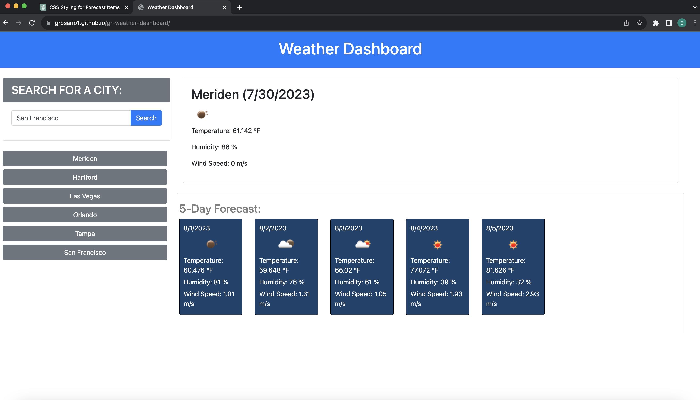

# GR - Weather Dashboard
## Description

This is a weather dashboard app that will display the current weather as well as the 5 day forecast of the city a user choses to search for.
The app makes an api (third-party api) call to the OpenweatherMap API to fetch for the following details and displays it on the page:
- City
- Current Date
- Temperature 
- Humidity 
- Wind Speed

## Installation

This site was deployed using github pages. 
The following github documentation link was used to follow steps on deploying github pages: 

https://docs.github.com/en/pages/getting-started-with-github-pages/creating-a-github-pages-site

## Usage

User enters a city into the form field, clicks on search and then the current weather information will display on the page in addition to the upcoming 5 day forecast information. A new button will display right below the input form with name of the city that was just searched. Every new city search will be saved as a new button for the user to go back and capture the weather information at any other given moment. See image below or click on the deployed link to use the app.

Link to deployed live URL [here.](https://grosario1.github.io/gr-weather-dashboard/)

You can find code repo [here.](https://github.com/grosario1/gr-weather-dashboard)

## Credits

Credit to the previous Module 5 & Module 6 excersizes to help me formulate the code.
